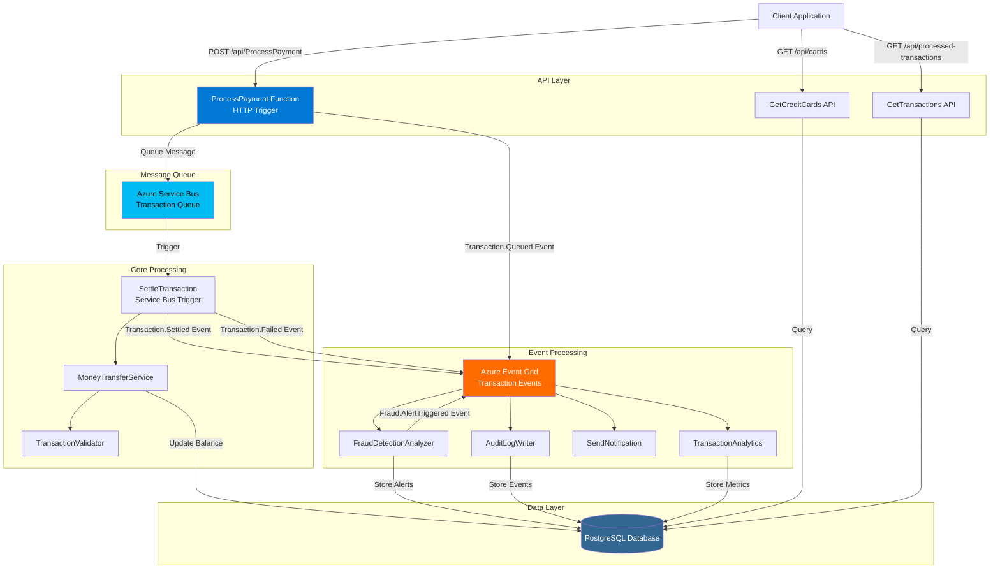

# 💳 Event-Driven Fintech Payment API

[](https://dotnet.microsoft.com/)
[](https://azure.microsoft.com/en-us/services/functions/)
[](https://www.postgresql.org/)
[](https://azure.microsoft.com/en-us/services/event-grid/)
[](https://github.com/features/actions)
[](./test/FintechProject.Tests/)

A production-ready, event-driven payment processing system built with Azure Functions, Event Grid, Service Bus, and PostgreSQL. Features comprehensive fraud detection, real-time notifications, transaction analytics, and full audit logging.

---

## 🎯 Project Overview

This fintech API demonstrates modern cloud-native architecture patterns including:

- **Asynchronous Processing** - Service Bus queues for reliable transaction handling
- **Event-Driven Architecture** - Event Grid for real-time event distribution
- **Microservices Pattern** - Decoupled functions with single responsibilities
- **CQRS Principles** - Separate read/write operations
- **Comprehensive Testing** - 51 unit tests with FluentAssertions and Moq
- **CI/CD Pipeline** - Automated deployment via GitHub Actions and Azure DevOps
- **Infrastructure as Code** - Bicep templates for Azure resource provisioning

---

## 🏗️ System Architecture



---

## ✨ Key Features

### 💰 Payment Processing
- ✅ **Asynchronous Money Transfers** - Service Bus queue-based processing
- ✅ **Multi-Currency Support** - USD, EUR, GBP, JPY, CAD
- ✅ **Comprehensive Validation** - Balance checks, card status, expiry validation
- ✅ **Transaction Tracking** - Unique transaction IDs with full audit trail
- ✅ **Idempotency** - Duplicate transaction prevention

### 🔐 Security & Fraud Detection
- ✅ **Real-Time Fraud Analysis** - 7 detection rules with risk scoring
- ✅ **Large Amount Detection** - Flags transactions > $10,000
- ✅ **Unusual Time Patterns** - Detects transactions 2-5 AM
- ✅ **Round Number Detection** - Identifies potential test transactions
- ✅ **Fraud Alert Events** - Automatic event publishing for high-risk transactions
- ✅ **API Authentication** - Function-level authorization keys

### 📊 Analytics & Monitoring
- ✅ **Application Insights Integration** - Custom metrics and telemetry
- ✅ **Transaction Metrics** - Hourly/daily volume aggregation
- ✅ **Success Rate Tracking** - Per-currency success/failure counts
- ✅ **Performance Monitoring** - Response times and execution duration
- ✅ **Database Analytics Views** - Pre-built SQL queries for insights

### 🔔 Notifications & Audit
- ✅ **Multi-Channel Notifications** - Email, SMS, Push (simulation ready)
- ✅ **Transaction Confirmations** - Sent to card holders
- ✅ **High-Value Alerts** - SMS for transactions > $1,000
- ✅ **Immutable Audit Log** - Complete event history in database
- ✅ **CloudEvents Standard** - Industry-standard event format

### 🧪 Testing & Quality
- ✅ **51 Unit Tests** - Comprehensive coverage with xUnit
- ✅ **Mocked Dependencies** - Isolated testing with Moq
- ✅ **Fluent Assertions** - Readable test expectations
- ✅ **CI/CD Integration** - Automated test execution
- ✅ **Test Documentation** - Beginner-friendly explanations

---

## 🛠️ Technology Stack

| Category | Technologies |
|----------|-------------|
| **Backend** | .NET 8.0, C# 12, Azure Functions (Isolated Worker) |
| **Database** | PostgreSQL 15, Entity Framework Core 8 |
| **Messaging** | Azure Service Bus, Azure Event Grid |
| **Storage** | Azure Blob Storage (Dead-letter queue) |
| **Monitoring** | Application Insights, Azure Monitor |
| **Testing** | xUnit, Moq, FluentAssertions, Coverlet |
| **CI/CD** | GitHub Actions, Azure DevOps Pipelines |
| **IaC** | Bicep, Azure CLI |
| **Dev Tools** | Azure Functions Core Tools, VS Code, Git |

---

## 📋 API Endpoints

### Payment Operations

| Method | Endpoint | Description | Auth |
|--------|----------|-------------|------|
| `POST` | `/api/ProcessPayment` | Initiate money transfer (async) | Function Key |
| `GET` | `/api/processed-transactions` | View transaction history | Function Key |
| `GET` | `/api/cards` | List all credit cards with balances | Function Key |
| `POST` | `/api/seed-cards` | Initialize test credit cards | Function Key |
| `GET` | `/api/test-cards` | View available test cards | Function Key |

### Example Request

```bash
curl -X POST https://your-function-app.azurewebsites.net/api/ProcessPayment \
  -H "Content-Type: application/json" \
  -H "x-functions-key: YOUR_FUNCTION_KEY" \
  -d '{
    "fromCardNumber": "4111111111111111",
    "toCardNumber": "5555555555554444",
    "amount": 100.00,
    "currency": "USD"
  }'
```

### Example Response

```json
{
  "success": true,
  "message": "Transfer request queued for processing",
  "transactionId": "a1b2c3d4-e5f6-7890-abcd-ef1234567890",
  "traceId": "abc12345",
  "fromCard": "****-****-****-1111",
  "toCard": "****-****-****-4444",
  "amount": 100.00,
  "currency": "USD"
}
```

📖 **[Full API Documentation →](./docs/guides/API_REFERENCE.md)**

---

## 🚀 Quick Start

### Prerequisites

- [.NET 8.0 SDK](https://dotnet.microsoft.com/download/dotnet/8.0)
- [Azure Functions Core Tools v4](https://docs.microsoft.com/azure/azure-functions/functions-run-local)
- [PostgreSQL 15+](https://www.postgresql.org/download/)
- [Azure CLI](https://docs.microsoft.com/cli/azure/install-azure-cli) (for deployment)

### 1. Clone Repository

```bash
git clone https://github.com/EmirU116/FintechProject.git
cd FintechProject
```

### 2. Setup Database

```bash
# Windows
.\scripts\setup-database.ps1

# Or manually
psql -U postgres -d postgres -f database/setup.sql
psql -U postgres -d fintech_db -f database/add_credit_cards_table.sql
psql -U postgres -d fintech_db -f database/event_grid_tables.sql
```

### 3. Configure Settings

Update `src/Functions/local.settings.json`:

```json
{
  "IsEncrypted": false,
  "Values": {
    "AzureWebJobsStorage": "UseDevelopmentStorage=true",
    "FUNCTIONS_WORKER_RUNTIME": "dotnet-isolated",
    "ConnectionStrings:PostgreSqlConnection": "Host=localhost;Database=fintech_db;Username=postgres;Password=yourpassword"
  }
}
```

### 4. Run Functions Locally

```bash
cd src/Functions
func start
```

### 5. Seed Test Data

```bash
curl -X POST http://localhost:7071/api/seed-cards
```

### 6. Test Payment

```bash
.\scripts\test-transfer.ps1
```

📘 **[Detailed Setup Guide →](./docs/setup/POSTGRESQL_INTEGRATION.md)**

---

## 🧪 Running Tests

```bash
# Run all tests
dotnet test

# Run with detailed output
dotnet test --logger "console;verbosity=detailed"

# Run specific test class
dotnet test --filter "FullyQualifiedName~MoneyTransferServiceTests"

# Generate coverage report
dotnet test /p:CollectCoverage=true /p:CoverageReportsFormat=opencover
```

**Test Results:**
- ✅ 51 tests passing
- 📊 3 test suites
- ⚡ ~3 seconds execution time

📖 **[Testing Guide →](./docs/guides/UNIT_TESTING_GUIDE.md)**

---

## 🌐 Event-Driven Flow

### Asynchronous Transaction Processing

```
┌─────────────────────────────────────────────────────────────┐
│                    ASYNC TRANSFER FLOW                       │
└─────────────────────────────────────────────────────────────┘

1️⃣ Client Request
   POST /api/ProcessPayment
   ↓
2️⃣ HTTP Response (202 Accepted)
   Returns immediately with transaction ID
   ↓
3️⃣ Service Bus Queue
   Message queued for reliable processing
   ↓
4️⃣ SettleTransaction (Triggered)
   - Validates transaction
   - Transfers money
   - Updates balances
   ↓
5️⃣ Event Grid Publishing
   - Transaction.Settled (success)
   - Transaction.Failed (error)
   ↓
6️⃣ Event Subscribers (Parallel)
   ├─→ FraudDetectionAnalyzer → Fraud alerts
   ├─→ AuditLogWriter → Immutable audit log
   ├─→ SendNotification → Email/SMS
   └─→ TransactionAnalytics → Metrics aggregation
```

📖 **[Event Flow Documentation →](./docs/guides/ASYNC_TRANSFER_FLOW.md)**

---

## 📊 Database Schema

```sql
-- Core Tables
credit_cards              -- Card information and balances
processed_transactions    -- Transaction history
audit_events             -- Immutable event log
fraud_alerts             -- Fraud detection results
transaction_metrics      -- Aggregated analytics
notification_logs        -- Notification delivery tracking

-- Views
recent_audit_events      -- Last 24 hours
pending_fraud_alerts     -- Alerts awaiting review
daily_transaction_summary -- 30-day metrics
```

📖 **[Database Documentation →](./database/README.md)**

---

## 🚢 Deployment

### Deploy to Azure

```bash
# 1. Login to Azure
az login

# 2. Create resources
az deployment group create \
  --resource-group fintech-rg \
  --template-file infra/main.bicep

# 3. Deploy function app
cd src/Functions
func azure functionapp publish event-payment-func

# 4. Run database migrations
psql -h your-azure-postgres.postgres.database.azure.com \
     -U adminuser -d fintech_db \
     -f ../../database/setup.sql
```

### CI/CD Pipeline

The project includes automated deployment pipelines:

- **GitHub Actions** - `.github/workflows/ci-cd.yml`
- **Azure DevOps** - `azure-pipelines.yml`

**Pipeline Steps:**
1. Build solution
2. Run unit tests
3. Deploy infrastructure (Bicep)
4. Deploy function app
5. Run database migrations

📖 **[CI/CD Setup Guide →](./docs/deployment/CICD_SETUP.md)**

---

## 📂 Project Structure

```
FintechProject/
├── src/
│   ├── Core/                      # Business logic layer
│   │   ├── MoneyTransferService.cs
│   │   ├── TransactionValidator.cs
│   │   ├── TransactionProcessor.cs
│   │   ├── Database/              # EF Core repositories
│   │   └── Events/                # Event data models
│   └── Functions/                 # Azure Functions
│       ├── ProcessPayment.cs      # HTTP trigger
│       ├── SettleTransaction.cs   # Service Bus trigger
│       ├── FraudDetectionAnalyzer.cs
│       ├── AuditLogWriter.cs
│       └── TransactionAnalytics.cs
├── test/
│   └── FintechProject.Tests/      # 51 unit tests
├── database/
│   ├── setup.sql                  # Schema creation
│   └── event_grid_tables.sql      # Event tables
├── infra/
│   └── main.bicep                 # Infrastructure as Code
├── docs/                          # Additional documentation
└── .github/workflows/             # CI/CD pipelines
```

---

## 📚 Documentation

### 📖 Guides
| Document | Description |
|----------|-------------|
| [API Reference](./docs/guides/API_REFERENCE.md) | Complete API documentation |
| [Money Transfer Guide](./docs/guides/MONEY_TRANSFER_GUIDE.md) | Transfer system overview |
| [Unit Testing Guide](./docs/guides/UNIT_TESTING_GUIDE.md) | Testing documentation |
| [Portfolio Guide](./docs/guides/PORTFOLIO_GUIDE.md) | Interview preparation |
| [Rate Limiting](./docs/guides/RATE_LIMITING.md) | Rate limiting implementation |
| [Async Flow](./docs/guides/ASYNC_TRANSFER_FLOW.md) | Transaction flow diagram |

### ⚙️ Setup & Configuration
| Document | Description |
|----------|-------------|
| [PostgreSQL Setup](./docs/setup/POSTGRESQL_INTEGRATION.md) | Database configuration |
| [Event Grid Integration](./docs/EVENT_GRID_GUIDE.md) | Event-driven architecture |
| [Database Setup (Windows)](./docs/setup/DATABASE_SETUP_WINDOWS.md) | Windows-specific setup |

### 🚀 Deployment
| Document | Description |
|----------|-------------|
| [CI/CD Setup](./docs/deployment/CICD_SETUP.md) | Complete deployment guide |
| [CI/CD Quickstart](./docs/deployment/CICD_QUICKSTART.md) | Quick reference |
| [Deployment Order](./docs/deployment/DEPLOYMENT_ORDER.md) | Step-by-step deployment |

### 🛠️ Scripts
| Script | Description |
|--------|-------------|
| [setup-database.ps1](./scripts/setup-database.ps1) | Database initialization |
| [test-transfer.ps1](./scripts/test-transfer.ps1) | Payment testing |
| [setup-azure-credentials.ps1](./scripts/setup-azure-credentials.ps1) | Azure credentials setup |
| [diagnose-database.ps1](./scripts/diagnose-database.ps1) | Database diagnostics |

---

## 🔧 Configuration

### Required Environment Variables

```bash
# Azure Functions
AzureWebJobsStorage=UseDevelopmentStorage=true
FUNCTIONS_WORKER_RUNTIME=dotnet-isolated

# Database
ConnectionStrings__PostgreSqlConnection=Host=localhost;Database=fintech_db;...

# Event Grid (Optional for local dev)
EventGrid__TopicEndpoint=https://your-topic.eastus-1.eventgrid.azure.net/api/events
EventGrid__TopicKey=your-topic-key

# Service Bus (Managed by Azure Functions)
ServiceBusConnection=Endpoint=sb://your-namespace.servicebus.windows.net/...
```

---

## 🧰 Development Tools

```bash
# Start Azurite (local Azure Storage emulator)
azurite --silent --location ./azurite --debug ./azurite/debug.log

# Watch logs in real-time
func start --verbose

# Test Event Grid locally
ngrok http 7071
# Update Event Grid subscription with ngrok URL
```

---

## 🎓 Learning Resources

This project demonstrates:

- ✅ **Azure Functions** - Serverless compute patterns
- ✅ **Event-Driven Architecture** - Loose coupling with events
- ✅ **CQRS** - Command/Query separation
- ✅ **Repository Pattern** - Data access abstraction
- ✅ **Dependency Injection** - Inversion of control
- ✅ **Unit Testing** - TDD practices
- ✅ **Infrastructure as Code** - Bicep/ARM templates
- ✅ **CI/CD** - Automated deployment pipelines

---

## 🤝 Contributing

Contributions are welcome! This project is part of my portfolio demonstrating modern cloud-native development practices.

### Future Enhancements

- [ ] JWT authentication with Azure AD B2C
- [ ] API rate limiting and throttling
- [ ] Redis caching for frequently accessed data
- [ ] GraphQL API layer
- [ ] Docker containerization
- [ ] Kubernetes deployment manifests
- [ ] Performance benchmarking
- [ ] Load testing with Azure Load Testing
- [ ] Integration tests with Testcontainers
- [ ] OpenAPI/Swagger documentation

---

## 📄 License

This project is licensed under the MIT License - see the [LICENSE](LICENSE) file for details.

---

## 👨‍💻 Author

**Emir Usanmaz**
- GitHub: [@EmirU116](https://github.com/EmirU116)
- Repository: [FintechProject](https://github.com/EmirU116/FintechProject)

---

## 🙏 Acknowledgments

- Azure Functions team for excellent serverless platform
- PostgreSQL community for robust database system
- .NET team for modern framework and tooling
- xUnit, Moq, and FluentAssertions for testing frameworks

---

## 📞 Support & Questions

For questions or issues:
1. Check the [documentation](#-documentation) first
2. Review [closed issues](https://github.com/EmirU116/FintechProject/issues?q=is%3Aissue+is%3Aclosed)
3. Open a [new issue](https://github.com/EmirU116/FintechProject/issues/new)

---

<div align="center">

**⭐ Star this repository if you find it helpful!**

Built with ❤️ using .NET 8.0 and Azure

</div>
